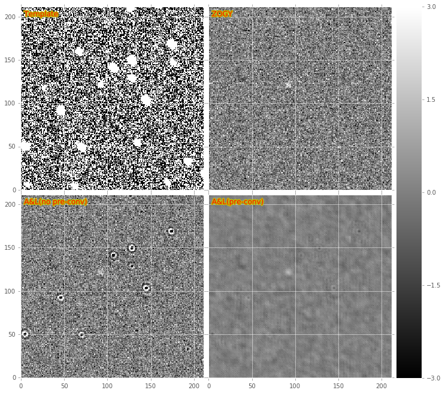
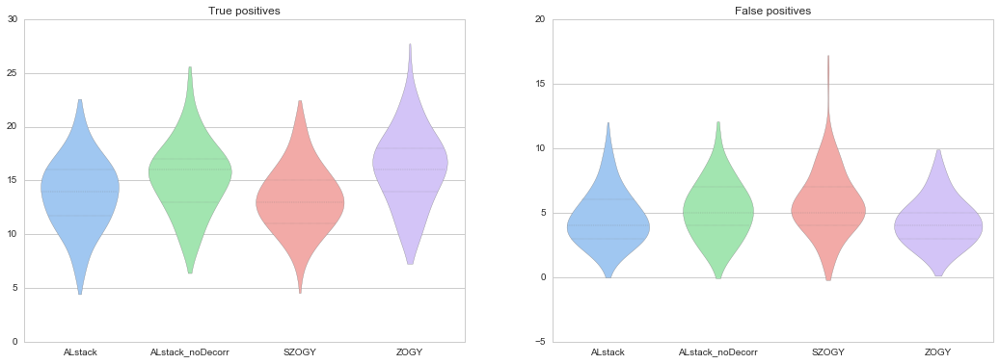
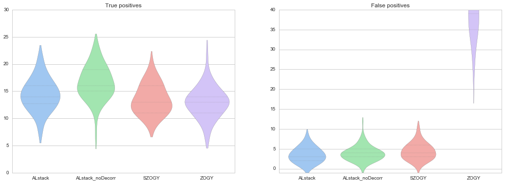
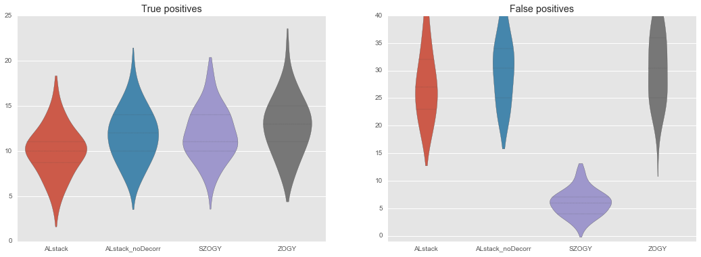
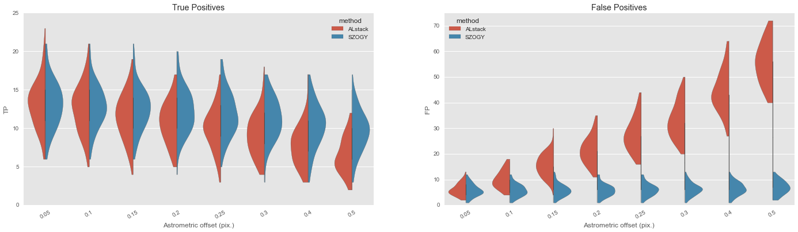
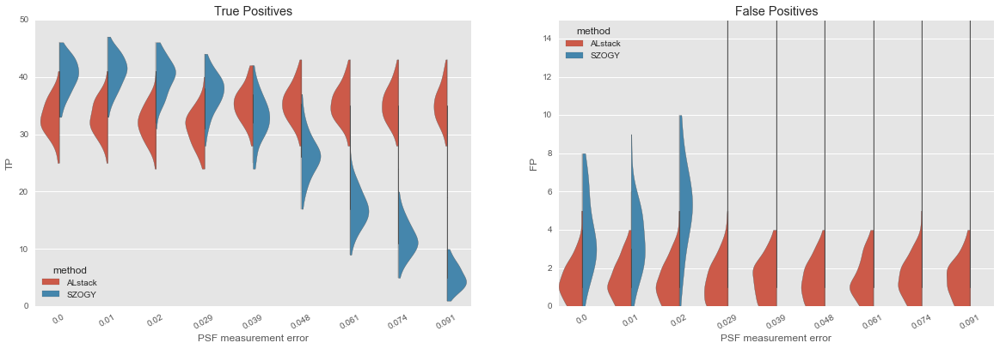
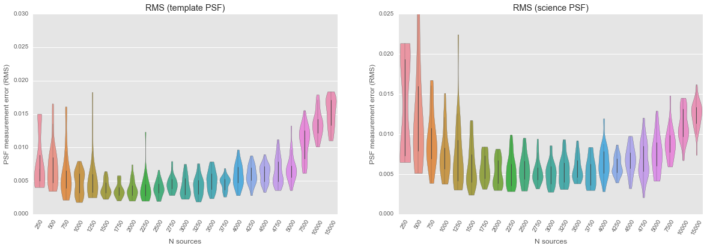
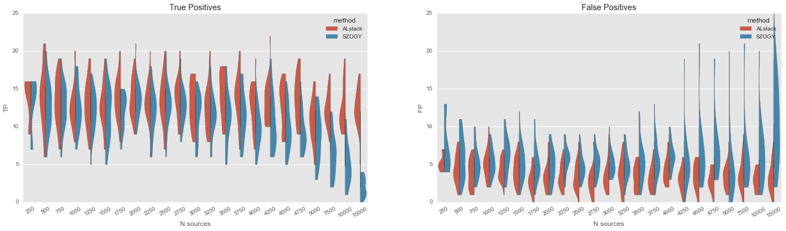

# Notes on shoot-out between ZOGY and A&L (with decorrelation and optional pre-filtering).

All code and notebooks are in this repository, specifically the code is in the `diffimTests.py` module.

## Necessary ingredients for the shoot-out:

1. A function which can create simulated pairs of simple images (template and science images) with specificed numbers of point-sources of varying flux (one of which can be variable between the two images) and signal-to-noise, and with PSFs of varying shape. All PSFs are Gaussian, but they may be elongated in either axis, and rotated. PSFs may additionally be spatially varying, and their centroids may be offset between the two images.
2. A "clean-room" pure-python method that can apply A&L image subtraction to these simulated images, including pre-filtering *or* decorrelation (see *Note* below).
3. A "clean-room" pure python method that can apply the ZOGY algorithm to these simulated images. It can do so either completely in Fourier space, or by only computing kernels in Fourier space and then convolving the images in real (image) space. It can also compute the ZOGY matched-filtered image $S$ and its corrected version $S_{corr}$.
4. A wrapper that performs the LSST-stack (`ip_diffim`) version of A&L on the simulated images, with pre-filtering (pre-convolution of the science image with its PSF) *or* decorrelation (see *Note* below).

*Note: Currently for both implementations of A&L, decorrelation with pre-filtering does not work. [UPDATE: It appears that I have figured out how to get it to work, with creative usage of `fftshift()` and `ifftshift()` in various locations. Still needs to be thoroughly vetted. UPDATE2: It does not seem to generate a likelihood image that is as optimal as the ZOGY $S_{corr}$.]*

A comparison of the three different implementations (actually, four) is shown in Cell[30] of [this notebook](https://github.com/djreiss/diffimTests/blob/master/25.%20Compare%20basic%20ZOGY%20and%20ALCZ%20with%20preconvolution-final.ipynb), and in the figure below, for an example when the template's PSF is wider than that of the science image. Both A&L image differences are computed with the decorrelation "afterburner" enabled.

We clearly see the deconvolution artifacts surrounding locations of bright stars in the A&L case with no pre-convolution, however with pre-convolution enabled, the resulting likelihood image shows only insignificant artifacts surrounding those locations.

## Observations about the different methods

1. I note that the combination pre-filtering + A&L + decorrelation has the potential to lose pixels around edges and masks due to up to *three* convolutions. In contrast ZOGY (with convolutions in image space) has effectively *one* convolution of each image, and should lose fewer pixels.
2. A&L loses sensitivity if a large number of sources are increasing in flux between the two simulated images. This is because it adjusts the kernel to scale the fluxes given the assumption that no sources are changing. This is a not a big concern in practice.
3. A&L (stack version) run-time scales with number of sources, as it performs PSF matching surrounding the bright stars only. For example, the timings in the table below are for images with 50 sources. If we increase the number to 250, the timing for A&L (stack; pre-filtering=No) is 2.31s, an increase of 25%.
4. ZOGY provides a method for correcting the corrected likelihood image $S_{corr}$ by pixel-wise variance, as well as by astrometric errors between the two images (which must be measured). I have implemented both of these corrections (the correction for astrometric noise uses ZOGY eqns. 30-33), and note that performing them requires the an additional two convolutions of each of the science and template images (not a factor regarding loss of border pixels, but just timing).

## Timings

I have compared the run-time of the algorithms on a pair of basic 2k x 2k -pixel images with 250 sources and a slightly elongated PSF in the science image. For all A&L runs, warping was disabled, and decorrelation was enabled *only* when pre-filtering was disabled. For all tests, PSFs were 25x25 pixels. Timings were performed using `%timeit` in an IPython notebook, and using a single core on `lsst-dev` (Intel Xeon E5-2687W @ 3.10GHz). The ZOGY "pre-filtering enabled" runs are actually those where $S_{corr}$ is computed in addition to $D$ (as pre-filtering is not necessary with ZOGY, but the resulting $S_{corr}$ corresponds to the match-filtered $D$, as it does for A&L with pre-filtering enabled). The comparisons are in [this notebook](https://github.com/djreiss/diffimTests/blob/master/25.%20Compare%20basic%20ZOGY%20and%20ALCZ%20with%20preconvolution-final.ipynb). Results:

| Method        | Pre-filtering? | Time (sec.) |
|---------------|------------------------|----------------------|
| A&L (custom)  | Yes | 487   |
| A&L (custom)  | No  | 442   |
| A&L (stack)   | Yes | 30.7  |
| A&L (stack)   | No  | 26.1  |
| ZOGY (real)   | Yes | 21.2   |
| ZOGY (real)   | No  | 14.8   |
| ZOGY (FT)     | Yes | 8.69   |
| ZOGY (FT)     | No  | 2.3   |

ZOGY is slightly ($\sim 2\times$) faster than A&L(stack) in these tests. It should be noted that A&L scales (primarily) with the number of bright sources selected for PSF matching, and partly with image size. ZOGY should scale only with image size. If the field is more crowded, it is likely that A&L run-time performance will worsen, whereas this is not true for ZOGY. For example, the same test on A&L (stack, no pre-filter) on simulated images with 10x as many soures has a timing of 43.2 sec., or nearly $2\times$ slower. An additional note: we should consider whether to use the FT-based version of ZOGY if we choose to move forward with that algorithm as it is $\sim 3 - 8 \times$ faster than the real-space implementation.

## Performance

We will now evaluate performance of the algorithms. We will describe the measures of performance below, and then define the different tests.

### Detection

We will use the rate of true-postive detections (fraction of input sources actually detected by the algorithm) and false-positive detections (number of false detections divided by number of input sources) to quantify the performance of each algorithm in each set of simulated images. Ideally, the true-positive rate would be 100%, and the false-positive rate would be 0%.

### Tests/simulations

For the simulated input images, we will vary:

1. The number of static and variable sources (and relative numbers of each type)

2. The relative widths/shapes/offsets of PSFs between the two images. This will include: 
 
 2a. The "canonical" case of near-Gaussian PSFs with that of the science image being wider than that of the template.
 
 2b. The inverse case where the PSF of the science image is narrower (or equal to) that of the template
 
 2c. Cases where PSF of one image are elongated in one axis to be broader than that of the other image
 
3. Cases where PSFs of science and/or template image are mis-measured by a certain amount (we will quantify it in terms of percentage mismeasurement of PSF sigma).
 
4. Cases where images are systematically astrometrically offset from each other by a fraction of a pixel

5. Cases where noise of one or both images are mis-measured.

6. Combinations of all of the above.

## First results

### Baseline

To establish a baseline, we performed an initial set of simulations described by (2a.) above in [this notebook](https://github.com/djreiss/diffimTests/blob/master/26.%20algorithm%20shootout%20-%20detection-Copy2.ipynb), using elliptical Gaussian PSFs of widths [1.6, 1.6] pixels (template) and [1.8, 2.2] pixels (science). The science image PSF was also rotated by 45 degrees. We inserted 1000 static sources in both 512x512-pixel images, with stellar number densities $n$ following a power-law dependent on flux $f$: $n \propto f^{-3/2.512}$ (i.e., a $\sim 3\times$ increase in number density per unit increase in apparent magnitude). We also added 50 "new" sources to the science image with a SNR of $\sim$ 5-sigma. Each simulation was performed 100 times with different noise realizations, source locations and (static) source fluxes. The results are summarized below:

Here we show the distributions of true-positives (left) and false-positives (right) for two versions of each algorithm. `ALstack` is the currently-implemented A&L algorithm in the LSST software stack, including diffim decorrelation ([DMTN-021](http://dmtn-021.lsst.io/)), and `ALstack_noDecorr` is the same with decorrelation disabled. `ZOGY` is the standard ZOGY algorithm, implemented in real-space. `SZOGY` denotes the computation of the ZOGY corrected likelihood image $S_{corr}$. In all cases, detection was performed at 5-$\sigma$ and in all cases except `SZOGY` detection included the pre-matched-filter convolution step. It is apparent that the `SZOGY` method seems to slightly outperform in both true positives (with a slightly greater percentage of the ten variable sources detected) and false positives (with a slightly greater weighting of zero false positives detected). We obtained the same result when implanting fake "new" sources of both ~3.3-$\sigma$ and ~10-$\sigma$ SNR. This is not entirely surprising since we are supplying ZOGY with additional information (exactly correct PSFs) that A&L does not utilize.

### Systematic astrometric mis-registration
We performed an initial set of simulations to test case (4.) above; i.e. when the two images are systematically (uniformly) mis-aligned by 0.3 pixels in both x- and y- directions. A&L should be able to account for this mis-alignment, because it is systematic, by incorporating it into the PSF matching kernel. ZOGY handles this situation by incorporating a measured astrometric "noise" into the variance which goes into the denominator of $S_{corr}$ (basically reducing the dynamic range for detection in regions surrounding bright dipoles). The results of these simulations are in [this notebook](https://github.com/djreiss/diffimTests/blob/master/26.%20algorithm%20shootout%20-%20detection-Copy3.ipynb), and shown below for 15-$\sigma$ "new" sources:

Clearly, the `ZOGY` uncorrected diffim cannot handle the astrometric offsets, but the corrected `SZOGY` likelihood image performs similarly to the case (above) with no astrometric offset. There is, however a slight increase in false-positives for the `SZOGY` case relative to A&L. A&L seems to somewhat improve in performance in this case relative to the baseline above. This is currently not understood.

### Random astrometric mis-registration

it was pointed out (by Eran Ofek) that these mis-measured-PSF simulations included no astrometric "scintillation" (i.e., random astrometric offsets), which, if included, will decrease A&L sensitivity but should not affect PSF measurement (and therefore not affect ZOGY). According to the LSST Science Book, we don't expect scintillation to be an issue at greater than $\sim 5$mas, or $\sim 0.025$ pixels (even less for coadds of two 15-sec. LSST snaps). However, there are often registration errors which have a similar effect to these randomized astrometric offsets. DCR will have similar effects as well. Therefore, I performed simulations containing 0.05-pixel (standard deviation) random astrometric offsets on all stars in the science image. In this case, for ZOGY we measured the astrometric variance, and used that to normalize the variance plane of the $S_{corr}$ corrected likelihood image. We found that at the given level of astrometric noise (0.05 pixels), A&L does not degrade, and thus ZOGY $S_{corr}$ provides no benefit. Some experimentation found that, at least for these simulations, it was not until we reach at $\sim 0.2$ pixels of astrometric noise ($\sim 40$ mas), that A&L (and also the uncorrected ZOGY diffim) begins to deteriorate. Only the corrected ZOGY $S_{corr}$ can accommodate the large amount of random astrometric offsets. We show these results (for 0.2 pixels) below.

And for gradually increasing random astrometric offsets here (we note that the regular ZOGY performs identically to A&L, it is the ZOGY $S_{corr}$ which accounts for the astrometric errors and thus reduces false positives.

An additional note about the ability for the ZOGY $S_{corr}$ to correct for random astrometric errors. This is essentially a "dipole corrector" that reduces the dynamic range near bright stars in the original images. This could reduce the detectability of slow-moving objects (distant SSO's; stellar proper motions). This needs to be further evaluated, if we hope to use $S_{corr}$ in production.

### PSF mismeasurement
We also performed an initial set of simulations to test case (3.) above; i.e. when the PSF is mis-measured, at what point does this lead to significant performance degradation of ZOGY? We used the same parameters as above, except in each case, we reported a slightly incorrect science image PSF (both FWHMs and rotation angle). The results are in [this notebook](https://github.com/djreiss/diffimTests/blob/master/28.%20algorithm%20shootout%20-%20updated.ipynb) and are summarized below:

This complicated set of "violin" plots shows true- and false-positives for `ALstack` and `SZOGY` (as described above) for gradually increasing mis-measurement of the science image PSF, in simulated images that contained 1,000 static sources and 50 transient sources. We plot the PSF mismeasurement error in units of weighted RMS(truePSF - falsePSF). In these units, $\sim 0.025$ along the x-axis of these plots corresponds to a $\sim 5\%$ mis-measurement of the PSF FWHM. Unsurprisingly, the PSF mis-measurement has no effect on A&L (as this information is not used by the algorithm). It also has little effect on the rate of true-positive detection for `SZOGY`. However, the rate of false-positive detections clearly takes off right around $\sim 0.025$, or about 5% mis-measurement of the PSF FWHM. This might correspond to an unrealistically pessimistic PSF measurement error (hopefully we can do better, even in crowded or very sparse fields!), but this essentially sets the limit to which ZOGY can be expected to perform adequately relative to A&L. I also performed simulations containing random astrometric offsets, in [this notebook](https://github.com/djreiss/diffimTests/blob/master/28.%20algorithm%20shootout%20-%20updated.ipynb), and there appears to be no discernable effect.

### PSF measurement evaluation

The question raised in the previous section is, "what is the actual error in PSF measurement from the LSST stack?" The LSST stack uses the `PSFex` algorithm for PSF measurement (a reimplemented version of the method described [here](http://psfex.readthedocs.io/en/latest/)). We tested PSF measurement by varying the number of stellar sources (crowding) in the simulated images and measured the weighted RMS between input and measured PSFs. Since our PSFs were not spatially-varying, we set the `PSFex` `spatialOrder` to 1 (setting it to zero caused failures). We varied `n_sources` between 50 and 15,000. Given the pixel scale for LSST and the 512x512 pixel size of the simulated images, 5,000 stars corresponds to $\sim 5\times 10^6$ sources per square degree. The result is shown below, for a simulated "template" with FWHM of 1.6 pixels, and a "science image" with elongated PSF (FWHM of 1.8 and 2.2, rotated 45 degrees):

Precision of PSF determination decreases at low source densities (too few "examples" to construct a PSF) and then again at stellar densities close to what is observed in the plane of the MW. (Complete notebook is [here](https://github.com/lsst-dm/diffimTests/blob/master/27.%20psf%20measurement%20evaluation%20-%20part%202.ipynb), including an example of a dense field simulation which leads to ZOGY failing.)

We then evaluated both A&L and ZOGY on these simulated images, using *measured PSFs*. The results are shown below:

We see that performance degrades for ZOGY when using PSFs measured at high densities, with the rate of true positive detections decreasing above stellar densities of $\sim> 4,000$ ($\sim > 2\times 10^6$ per sq. deg.), and the rate of false positives increasing slightly at the same point. A prime reason for the significant degradation in ZOGY at high densities arises more from the vast increase in densities (which leads to large relative increases in false positives and a corresponding decrease in true positive detections).

We note again that for these simulations there were no random astrometric offsets, which the ZOGY authors claim improve the performance of ZOGY (via the $S_{corr}$ corrected likelihood image) and degrade A&L. We did run simulations with added scintillation at the scale of 0.05 pixels (roughly 0.1 mas at LSST pixel scale). The results are shown in [this notebook](https://github.com/djreiss/diffimTests/blob/master/29.%203.%20re-run%20psf%20measurement%20with%20new%20flux%20distribs%20and%20SNRs.ipynb), showing that, when a small amount of scintillation is added, A&L indeed degrades when using PSFs determined at high stellar densities, while ZOGY still suffers in performance. This simulation may be an overestimation of the true expected effect of scintillation on astrometry for LSST, and could be the reason for A&L degradation at high densities. Still, it is possible that atmospheric effects plus other systematics could lead to this type of semi-random registration error. This will need to be evaluated on real images to understand better.

We should note that the degradation of ZOGY is *not* a function of stellar density alone, which we show in [this notebook](https://github.com/djreiss/diffimTests/blob/master/29.%203.%20re-run%20psf%20measurement%20with%20new%20flux%20distribs%20and%20SNRs.ipynb). It is solely due to degradation in PSF measurement at high stellar densities. Of course, at high stellar densities, when the algorithm performs poorly, we get greater numbers of false positive detections.

## Summary

The results of the previous section showed that ZOGY performance deteriorates for these simulated images at stellar densities greater than roughly $2\times 10^6$ stars per sq. deg. According to Cell #11 of [this notebook](https://github.com/lsst/sims_maps/blob/master/notebooks/Star_Map_Examples.ipynb), for $r < 25$, we expect densities of around that level near the galactic bulge. The estimates in that notebook are extrapolations, and may represent an underestimation of densities in the galactic plane. Thus, a recommendation is to investigate "fixing" PSF measurement in dense fields, which should be possible using an iterative, "DAOPhot-like" approach.